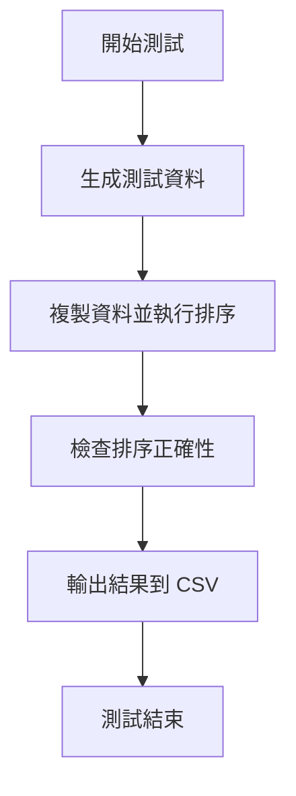

# 41343127 
主要負責程式實作與整體架構設計。  
包含圖的建立（鄰接矩陣與 Edge List）、選單系統整合，以及 DFS、BFS、Kruskal、Prim、Dijkstra、Bellman-Ford、Floyd、Reach、AOV、AOE 與 Biconnected Components 等演算法的撰寫與測試。  
# 41343150
主要負責報告撰寫與排版整理。  
包含解題說明、解題策略、申論及開發報告與結論撰寫，以及整體 Markdown 排版與內容整理，確保報告格式一致且易於閱讀。  

## 解題說明

在這份專案中，我們以 C++ 實作多種排序演算法，並透過 benchmark 程式比較它們在不同資料規模下的執行時間。依目前倉庫結構，排序演算法分別放在 `src/sorting/insertion_sort.cpp`、`src/sorting/quick_sort.cpp`、`src/sorting/merge_sort.cpp`、`src/sorting/heap_sort.cpp`、`src/sorting/composite_sort.cpp`；測試資料生成放在 `src/generator.cpp`；計時功能放在 `src/benchmark/timer.cpp`；主程式則是 `src/benchmark/main.cpp`。

本作業的重點是比較各排序法在 benchmark 中 `Worst` 與 `Average` 兩種情況下的時間差異。需要說明的是：在這份程式的實作裡，`Worst` 並不完全等於每一種排序法的理論絕對最壞輸入。`InsertionSort` 會使用反向資料，`MergeSort` 會使用 `makeMergeWorst()` 產生的資料，`QuickSort` 與 `HeapSort` 則是從 20 次隨機排列中取最大耗時；`CompositeSort` 會依實際分支選擇對應的 worst 測資。最終結果會輸出為 `result.csv`，方便後續做圖或比對。

## 程式實作

### Insertion Sort（插入排序）

    void insertionSort(int a[], int n)
    {
        for(int i = 1; i < n; i++)
        {
            int key = a[i];
            int j = i - 1;

            while(j >= 0 && a[j] > key)
            {
                a[j + 1] = a[j];
                j--;
            }

            a[j + 1] = key;
        }
    }

  * 將陣列分成已排序區與未排序區。
  * 每次取出一個元素插入已排序區的正確位置。
  * 適合小型資料，或接近排序完成的資料。

---

### Merge Sort（合併排序）

    void mergeSort(int a[], int n)
    {
        if(n <= 1)
        {
            return;
        }

        int* temp = new int[n];

        for(int size = 1; size < n; size = size * 2)
        {
            for(int left = 0; left < n; left = left + size * 2)
            {
                int mid = min(left + size, n);
                int right = min(left + size * 2, n);

                mergePart(a, temp, left, mid, right);
            }

            for(int i = 0; i < n; i++)
            {
                a[i] = temp[i];
            }
        }

        delete[] temp;
    }

    void mergePart(int a[], int temp[],
                   int left, int mid, int right)
    {
        int i = left;
        int j = mid;
        int k = left;

        while(i < mid && j < right)
        {
            if(a[i] <= a[j])
                temp[k++] = a[i++];
            else
                temp[k++] = a[j++];
        }

        while(i < mid)
            temp[k++] = a[i++];

        while(j < right)
            temp[k++] = a[j++];
    }

  * 使用分治法的概念，但目前程式是 bottom-up 的迭代版本。
  * 每次把相鄰的已排序區塊合併成更大的排序區塊。
  * 平均與最壞時間複雜度都維持在 `O(n log n)`，但需要額外暫存空間。

---

### Heap Sort（堆積排序）

    void percDown(int a[], int i, int n)
    {
        int child;
        int temp = a[i];

        while(i * 2 + 1 < n)
        {
            child = i * 2 + 1;

            if(child != n - 1 &&
               a[child] < a[child + 1])
            {
                child++;
            }

            if(temp < a[child])
            {
                a[i] = a[child];
            }
            else
            {
                break;
            }

            i = child;
        }

        a[i] = temp;
    }

    void heapSort(int a[], int n)
    {
        for(int i = n / 2 - 1; i >= 0; i--)
        {
            percDown(a, i, n);
        }

        for(int j = n - 1; j > 0; j--)
        {
            swap(a[0], a[j]);
            percDown(a, 0, j);
        }
    }

  * 利用最大堆積（Max Heap）的性質排序。
  * 每次把目前最大值移到陣列尾端。
  * 額外空間需求低，時間複雜度穩定。

---

### Quick Sort（快速排序）

    int medianOfThree(int a[],
                      int left,
                      int right)
    {
        int mid = (left + right) / 2;

        if(a[mid] < a[left])
            swap(a[left], a[mid]);

        if(a[right] < a[left])
            swap(a[left], a[right]);

        if(a[right] < a[mid])
            swap(a[mid], a[right]);

        swap(a[mid], a[right - 1]);

        return a[right - 1];
    }

    void quickSortRange(int a[],
                        int left,
                        int right)
    {
        if(left + 10 <= right)
        {
            int pivot =
                medianOfThree(a, left, right);

            int i = left;
            int j = right - 1;

            while(true)
            {
                while(a[++i] < pivot){}
                while(a[--j] > pivot){}

                if(i < j)
                    swap(a[i], a[j]);
                else
                    break;
            }

            swap(a[i], a[right - 1]);

            quickSortRange(a, left, i - 1);
            quickSortRange(a, i + 1, right);
        }
        else
        {
            smallInsertionSort(a, left, right);
        }
    }

    void quickSort(int a[], int n)
    {
        if(n > 1)
        {
            quickSortRange(a, 0, n - 1);
        }
    }

  * 使用 Median-of-Three 選 pivot，降低常見壞案例的機率。
  * 小區段改用 insertion sort 收尾，減少遞迴與常數成本。
  * 平均情況通常很快，但理論最壞時間仍是 `O(n^2)`。

---

### Composite Sort（混合排序）

    void compositeSort(int a[], int n)
    {
        if(n <= 30)
        {
            insertionSort(a, n);
        }
        else
        {
            mergeSort(a, n);
        }
    }

  * 小型資料使用 Insertion Sort。
  * 大型資料使用 Merge Sort。
  * 這份實作結合的是 insertion 與 merge，不是 insertion 與 quicksort。

---

### Benchmark 效能測試

    typedef void (*SortFunction)(int[], int);

    void buildWorstData(string name, int a[], int n)
    {
        if(name == "InsertionSort")
        {
            makeReverse(a, n);
        }
        else if(name == "MergeSort")
        {
            makeMergeWorst(a, n);
        }
        else if(name == "CompositeSort")
        {
            if(n <= 30)
            {
                makeReverse(a, n);
            }
            else
            {
                makeMergeWorst(a, n);
            }
        }
        else
        {
            makeRandomPermutation(a, n);
        }
    }

    double testOneTime(SortFunction sortFunction,
                       int data[],
                       int n)
    {
        int* a = new int[n];

        copyArray(data, a, n);

        auto start =
            high_resolution_clock::now();

        sortFunction(a, n);

        auto end =
            high_resolution_clock::now();

        if(!checkSorted(a, n))
        {
            cout << "sort error" << endl;
        }

        delete[] a;

        return getElapsedTime(start, end);
    }

  * 使用 `chrono` 函式庫進行計時。
  * 排序前先複製陣列，避免原始測資被前一次排序改動。
  * `Worst` 與 `Average` 的資料生成方式會依排序法而不同。
  * 最後輸出到 `result.csv` 做後續分析。

## 解題策略

這份程式的主要流程如下：

  * 資料生成：`src/generator.cpp` 提供了 `makeSorted()`、`makeReverse()`、`makeRandomPermutation()` 與 `makeMergeWorst()`。其中 `makeMergeWorst()` 的用途是生成對 merge 過程較不利的輸入順序，不是模擬分割不均。
  * 複製陣列：為了避免排序直接改動原始測資，我在每次正式計時前都先複製一份資料，再把排序函式套在複本上。
  * 執行排序並計時：`src/benchmark/timer.cpp` 提供 `getElapsedTime()`，在排序前後記錄時間差。
  * 組合排序策略：`compositeSort()` 對小於等於 30 的陣列使用 insertion sort，超過 30 則直接交給 merge sort。
  * 結果檢查：每次排序完都會呼叫 `checkSorted()`，確認結果是否為升序。
  * 數據收集：`src/benchmark/main.cpp` 會依序測試 `500`、`1000`、`2000`、`3000`、`4000`、`5000` 六種資料規模，並把結果寫入 `result.csv`。

另外要補充一點：目前 benchmark 在不同排序之間，並不保證共用完全相同的 20 組隨機輸入，因為每個排序都會各自呼叫 `makeRandomPermutation()`。這不會影響程式正確性，但如果要做更嚴格的橫向比較，之後還可以再把測資共享機制補上。

## 效能分析

排序演算法的時間與空間複雜度如下表所示：

| 排序演算法 | 平均時間複雜度 | 最壞時間複雜度 | 空間複雜度 |
|---------------|--------------|--------------|---------|
| 插入排序 | `O(n^2)` | `O(n^2)` | `O(1)` |
| Median-of-Three 快速排序 | `O(n log n)` | `O(n^2)` | `O(log n)` |
| 迭代合併排序 | `O(n log n)` | `O(n log n)` | `O(n)` |
| 堆積排序 | `O(n log n)` | `O(n log n)` | `O(1)` |
| 複合排序 | `O(n log n)` | `O(n log n)` | `O(n)` |

由理論來看，插入排序在資料量變大後會最明顯地變慢；快速排序、合併排序和堆積排序則會維持在 `n log n` 等級。這份 `CompositeSort` 的實作因為大於 30 的資料會直接走 merge sort，所以它的整體特性更接近「insertion + merge」的混合，而不是「insertion + quicksort」。

另外，`result.csv` 裡的 `Worst` 欄位要解讀成這份 benchmark 設計下的 worst 測試結果，而不是所有演算法都已經拿到理論上的絕對最壞輸入。特別是 `QuickSort` 與 `HeapSort`，目前是以 20 次隨機排列中的最大耗時當作實驗上的 worst 值。

以下是 `result.csv` 的輸出格式示意：

```csv
Sort,Size,Case,Time
InsertionSort,500,Worst,<measured_time>
InsertionSort,500,Average,<measured_time>
QuickSort,500,Worst,<measured_time>
QuickSort,500,Average,<measured_time>
MergeSort,500,Worst,<measured_time>
MergeSort,500,Average,<measured_time>
```

從格式上可以看出，這份程式使用的是長表格式，比較適合後續用試算表、Python 或其他工具做繪圖與分組分析。

## 測試與驗證

目前這份 repository 內 benchmark 直接涵蓋的資料型態如下：

| 測試案例 | 資料示例 |
|----------|--------------------------|
| 反向排序 | `{5, 4, 3, 2, 1}` |
| 隨機排列 | `{8, 3, 5, 1, 9, 2, 7, 4, 6}` |
| Merge Worst 輸入 | 由 `makeMergeWorst()` 自動生成 |

我在程式流程中會對上述測資進行排序，並在每次排序後呼叫 `checkSorted()` 確認結果是否為升序。就目前倉庫的內容來看，重複元素與負數並沒有被正式放進 benchmark 流程；如果要進一步補強正確性驗證，建議另外寫一個小型測試程式把這些案例補上。

實際測試時，`src/benchmark/main.cpp` 會對多組資料大小重複執行排序並記錄時間。流程如下：



這樣的流程可以確保每一筆輸出的時間都有對應的資料生成、計時與排序驗證步驟。若後續要擴充，也可以直接在這個流程上加新測資或更多統計欄位。

## 結論

本專案確實呈現了不同排序演算法在資料量變大時的差異：插入排序會隨著 `n` 增加而明顯拉開耗時；快速排序、合併排序與堆積排序則維持在較平穩的 `n log n` 等級。這和課堂上對這幾種演算法的理論分析是吻合的。

需要特別修正的一點是：這份專案中的 `CompositeSort` 不是 insertion + quicksort，而是 insertion + merge sort。以目前門檻值 `30` 與測試規模 `500 ~ 5000` 來看，它大多會走 merge sort 分支，所以實測表現通常也會更接近 merge sort。它可能表現很好，但不應該直接寫成「一定是最快」或「等同 quicksort 的混合版」。

整體而言，這份作業完成了多種排序法的實作與 benchmark，比較適合拿來理解不同排序法在同一份測試框架下的行為差異。若之後要再往上補強，我會優先考慮讓所有排序共用同一批隨機測資，並補上重複元素與負數的正式測試。

## 申論及開發報告

  * 工作分配：這份專案由我與組員合作完成。分工上，一人負責插入排序與合併排序，另一人負責快速排序、堆積排序與複合排序；測資生成與 benchmark 整理則共同處理。
  * 編譯與執行：本倉庫未明確限制編譯器版本；若以目前資料結構直接編譯，我建議使用下列指令：

```bash
g++ -std=c++17 \
  src/benchmark/main.cpp src/benchmark/timer.cpp src/generator.cpp \
  src/sorting/insertion_sort.cpp src/sorting/quick_sort.cpp \
  src/sorting/merge_sort.cpp src/sorting/heap_sort.cpp \
  src/sorting/composite_sort.cpp \
  -O2 -o sorting_project
```

執行 `./sorting_project` 即可開始測試。

  * 注意事項：本倉庫目前沒有 `timer_test.cpp`。正式編譯只要把主程式、計時、資料生成與各排序檔一起編譯即可。
  * 問題與限制：`makeRandomPermutation()` 使用固定種子 `41343133`，所以同一環境下資料序列本身可重現；真正可能變動的是執行時間。此外，`QuickSort` 與 `HeapSort` 的 `Worst` 欄位目前採用的是 20 次隨機測試中的最大值，屬於實驗上的近似 worst 值，不是數學上保證的絕對最壞值。
  * 未指定項目：執行平台未指定、編譯器版本未指定、是否要一併提交實際 `result.csv` 與圖表未指定。若要先採穩定預設，我建議使用 Linux / macOS / WSL，並以 `g++` 或 `clang++` 搭配 `-std=c++17 -O2` 編譯。
  * 成果反思：這次把文件和程式對齊後，整份專案的邏輯清楚很多。對我來說，最大的收穫不只是把排序寫完，而是學到怎麼讓「程式、報告、輸出格式」三者保持一致，避免到最後交作業時出現內容對不起來的問題。
